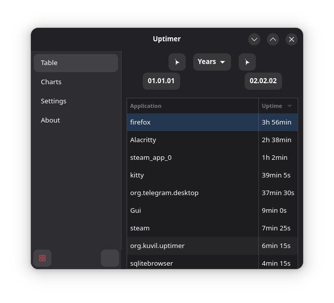

# Uptimer

## How do you spend your time?
Uptimer (work title) - tools for recording some PC usage information (like on-screen (focused) window uptimes. Browser focused tab and media in future) and present it with GUI.

All data stores locally, what makes Uptimer completely privacy

### How to build

git clone --depth=1 https://github.com/Kuvill/Uptime.git  
  
cd Uptime;  
meson setup build/;  
ninja -C build install;  

That's all!

Installation details

  Available targets: Uptimer, Gui 

  Also you can specify prebuild options from meson.options with **-D{option_name}={value}**
  Plus b_lto turned on by default

* Copy binary into /usr/local/bin/
* Copy Gtk scheme into ~/.local/share/uptimer/res/

#### Dependencies

All:
* libnotify

Demon:
- sqlite3

GUI:
- gtk4
- adwaita-1

### DE support

- [x] SwayWM
- [x] Hyprland
- [ ] X11 (In plan)

- [ ] MacOS (On request)

## Documentation

### Add your DE support

Implement DesktopEnv ( example declarations are in better_uptimer.hpp, defines - in de_dependent file )
include header file into better_uptimer.cpp, call registerate<{your class}>(); in registrateAll func;
write path to your source file in meason.build: demon_sources

## Screenshots

#### P.S.
Those date picker buttons and labels are fictional, except for the duration model( e.g. years ), which shows info up to today

